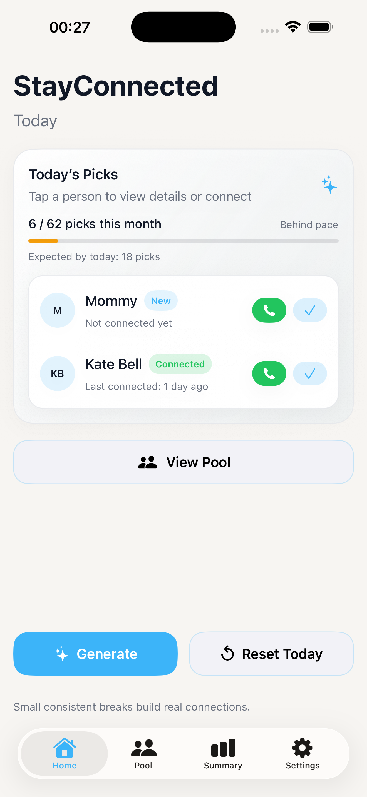
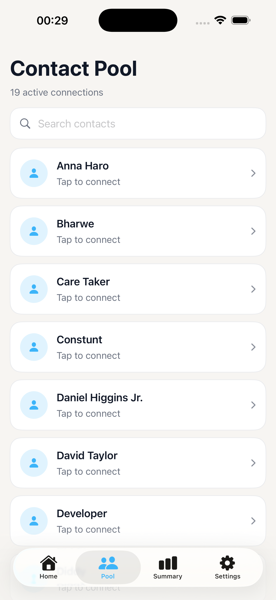
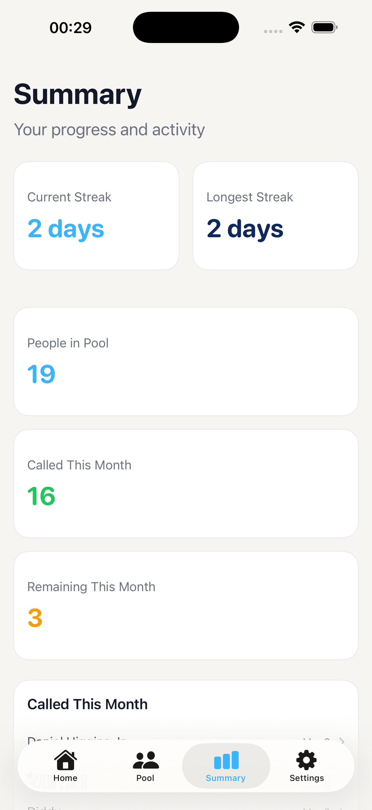
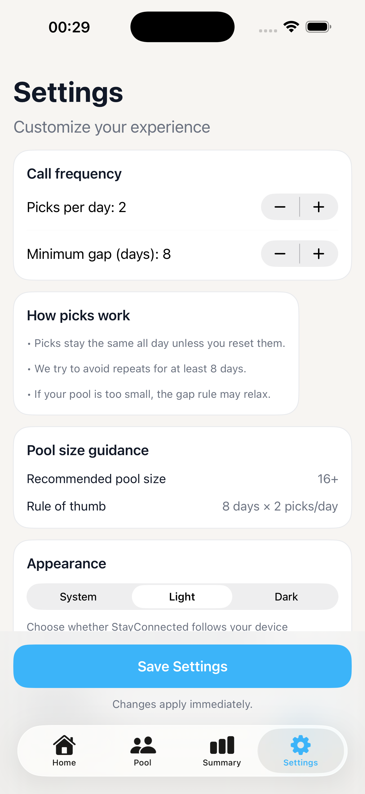

# StayConnected

StayConnected is an iOS app designed to help people maintain meaningful relationships through small, consistent communication.

The app intelligently selects a few contacts each day and encourages you to reconnect with them — helping prevent relationships from fading due to busy schedules.

---

## ✨ Features

- Daily contact selection algorithm
- Intelligent rotation to avoid repeated picks
- Call tracking and connection history
- Monthly progress tracking
- Contact pool management
- Dark Mode support
- Minimal, modern SwiftUI interface

---

## 🧠 How It Works

StayConnected selects a small set of contacts each day based on:

- Minimum gap between interactions
- Daily pick count
- Randomized weighting for fairness
- Fallback selection if the pool is too small

This ensures you consistently reconnect with people without repeating the same contacts too often.

---

## 📱 Screens

### Home
Shows today's selected contacts and progress for the month.



### Pool
Your full list of contacts eligible for daily selection.



### Summary
Statistics about your connection habits including:

- Current streak
- Longest streak
- Calls made this month
- Remaining connections



### Settings
Configure:

- Picks per day
- Minimum gap between contacts
- Light / Dark / System appearance


---

## 🏗 Architecture

The app follows a clean SwiftUI architecture:

```
Views
ViewModels
Models
Services
```

**Views**
SwiftUI UI components.

**ViewModels**
State management and UI logic.

**Models**
Data structures and CoreData entities.

**Services**
Business logic including the contact selection algorithm.

---

## ⚙️ Technologies

- SwiftUI
- CoreData
- Contacts Framework
- iOS 17+

---

## 🎨 Design

The UI uses a minimal Apple-style design system with:

- Soft gradients
- Rounded cards
- Subtle shadows
- Calm color palette

---

## 🚀 Future Improvements

- Notification reminders
- Widgets
- iCloud sync
- Call logging automation
- Analytics insights

---

## 📄 License

MIT License
